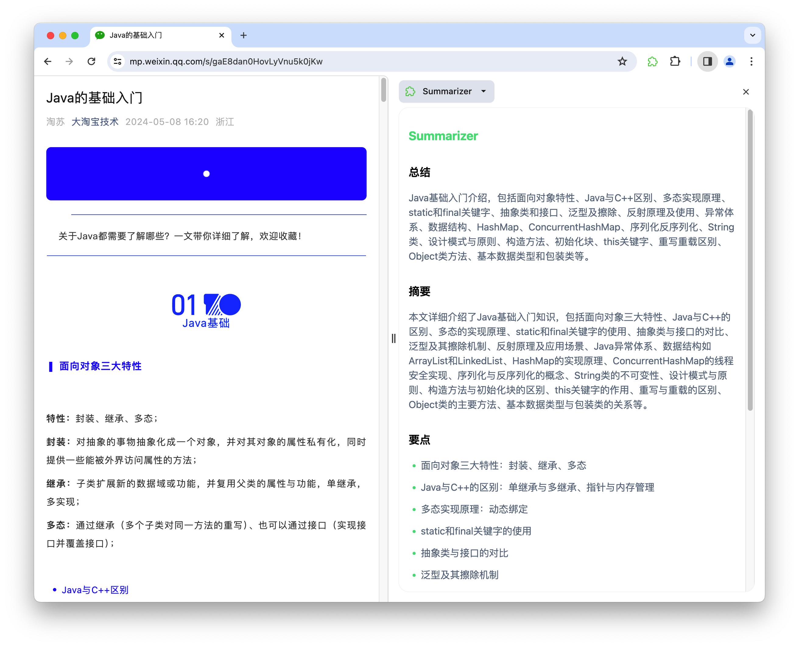

---

# Summarizer

Summarizer is a browser plug-in based on the [wxt framework](https://github.com/wxt-dev/wxt) that I learned and developed myself.



## Installation

```bash
# or npm or yarn
pnpm install
```

## Run
```bash
pnpm dev
```

## TODO

> Not sure how to implement it

- [ ] Stream output
- [ ] Turn off sidepanel when switching pages 

## Credits
This project is strongly inspired by [ai-summarizer](https://github.com/linchen1987/ai-summarizer).


## LICENSE

[MIT](http://opensource.org/licenses/MIT)

---
